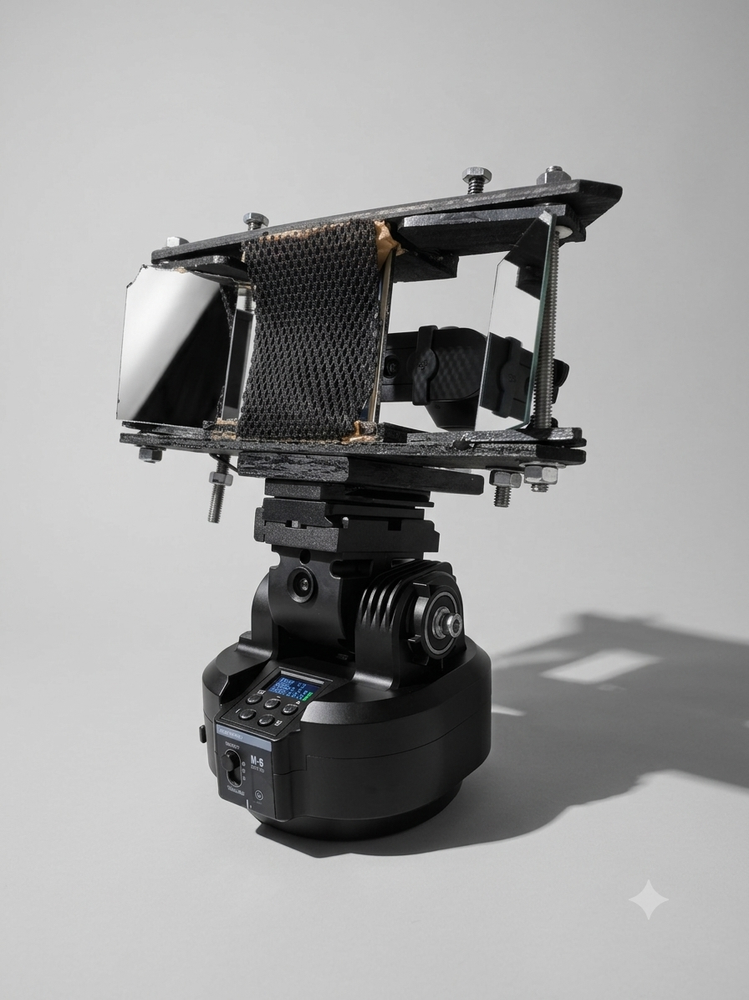

# Rig Specifications

**Working title:** The Rig  
**Inventor:** Craig C. Cline  
**Location:** Clyde, North Carolina  

---

## Photo

*First-generation beam-splitter stereo camera rig on SCONPHO M-6 pan/tilt mount.
Hand-fabricated steel frame, front-surface mirrors, 152mm baseline. Clyde NC, 2026.*

---

## Hardware

| Component | Specification |
|-----------|---------------|
| Configuration | Beam-splitter stereo camera |
| Baseline | 152mm |
| Camera | Logitech Brio 101 |
| Mount | SCONPHO M-6 motorized pan/tilt |
| Capture resolution | 1920x1080 stereo |
| Processing | Mac Mini M4 Pro |

---

## Environment Reference

Fixed room. Known geometry. Consistent lighting baseline.
Depth fingerprint and luminance grid recorded per session
and compared across sessions.

---

## Purpose

Provide a known physical anchor for spatially grounded 
AI queries. Same room, same geometry, same human —
accumulated across sessions.

---

## Research Claims

These are the system's testable hypotheses. Validation 
status is noted honestly.

| Claim | Status |
|-------|--------|
| Accumulated room state enables detection of physical changes across sessions separated by days or months | Hypothesized — not yet validated at scale |
| Stereo depth fingerprint provides object localization within the calibrated volume | Partial — localization range estimated 0.3m–3m at 152mm baseline; formal calibration RMS not yet recorded |
| Spatial memory accumulated across sessions improves AI query grounding compared to single-frame analysis | Core hypothesis — protocol established, longitudinal corpus in development |
| Pan/tilt angular resolution sufficient for room-scale object tracking | Pending — dependent on SCONPHO M-6 servo spec |
| Temporal persistence interval for room-state anchor exceeds 30 days under fixed lighting | Hypothesized from J-M Effect threshold work — not yet tested |

### Measurable Quantities (targets)

- **Stereo calibration accuracy:** OpenCV reprojection error RMS — to be recorded at next calibration run
- **Pan/tilt angular resolution:** degrees/step — pending SCONPHO M-6 specification
- **Depth estimation range:** ~0.3m–3.0m (analytical estimate at 152mm baseline, Brio 101 lens)
- **Temporal persistence interval:** minimum session gap before re-anchoring required
- **Environmental state representation:** per-session depth fingerprint + luminance grid (format and resolution to be formalized)
- **Query types supported:** spatial localization, room-state change detection, identity-grounded session continuity
- **Success metric:** query answer quality with vs. without accumulated spatial context (A/B protocol TBD)

---

*seeitwith.org*
